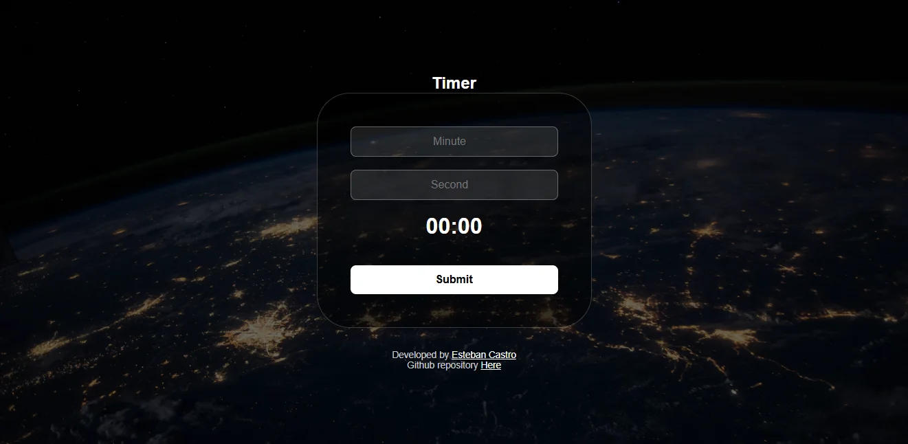
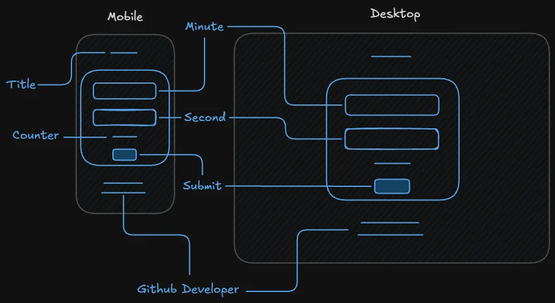
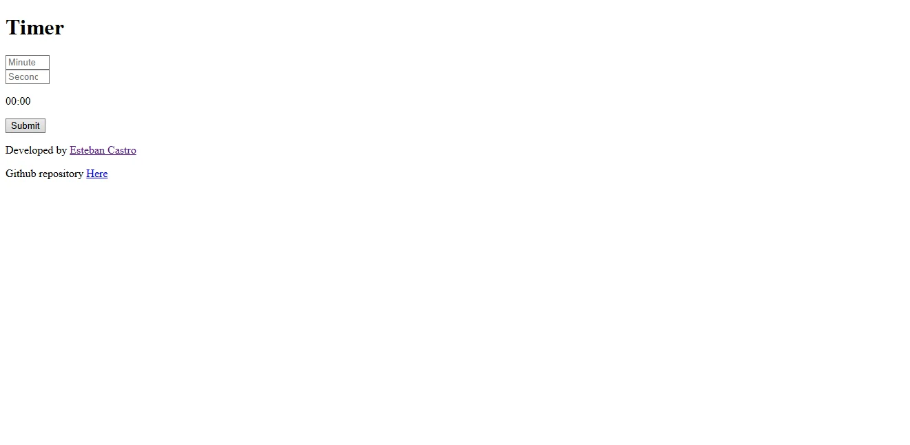

# **ÍNDICE**
* [1. Temporizador NASA (NASA Timer)](#1-temporizador-nasa-nasa-timer)
* [2. Realización del Proyecto](#2-realización-del-proyecto)
* [3. Tecnologías y Conceptos Empleados](#3-tecnologías-y-conceptos-empleados)
* [4. Autor](#4-autor)

***

    

***

## 1. Temporizador NASA (NASA Timer)
Esta aplicación web es un temporizador regresivo ambientado en una interfaz espacial de despegue. Permite configurar minutos y segundos para iniciar una cuenta regresiva que muestra en tiempo real el tiempo restante y despliega el mensaje de éxito *"The rocket launch was successful"* al finalizar el conteo.

El objetivo principal del proyecto es dominar el uso de funciones de temporización asíncronas en JavaScript (`setInterval`, `clearInterval`), la validación de formularios mediante expresiones regulares (Regex) y el formateo de cadenas de texto para interfaces digitales.

***
## 2. Realización del Proyecto

### 2.1 Wireframe:
Se diseñó la estructura base para dispositivos móviles y pantallas de escritorio, organizando la jerarquía visual de los inputs de tiempo, el contador principal y el pie de página.

    

### 2.2 Prototipo / Mockup:
Se construyó un prototipo inicial HTML/CSS para validar la funcionalidad de los campos numéricos y el renderizado del contador previo al diseño final.

    

***
## 3. Tecnologías y Conceptos Empleados

- [HTML5:](https://developer.mozilla.org/es/docs/Web/HTML) Maquetación semántica del formulario, controles de entrada numérica (`<input type="number">`) con límites de rango (`min`, `max`) y estructura general.

- [CSS3:](https://developer.mozilla.org/es/docs/Web/CSS) Diseñado bajo la metodología *Mobile First*, con una interfaz oscura sobre fondo espacial, contenedores centrados y tipografía técnica.

- [JavaScript (ES6+):](https://developer.mozilla.org/es/docs/Web/JavaScript) Implementación de la lógica del temporizador:
  - **Expresiones Regulares (Regex):** Uso de `NUMBER_REGEX` (`/^(?:[0-9]|[1-5][0-9]|60)$/`) para validar en tiempo real que las entradas de minutos y segundos se mantengan estrictamente entre 0 y 60.
  - **Módulos de Temporización (`setInterval` / `clearInterval`):** Gestión del flujo asíncrono para ejecutar el descuento de tiempo cada 1000 ms (1 segundo) y detener el intervalo exactamente al llegar a cero.
  - **Formateo de Cadenas (`String.prototype.padStart`):** Relleno dinámico de ceros a la izquierda (`padStart(2, "0")`) para garantizar una visualización consistente en formato de reloj digital (`00:00`).
  - **Control de Estados del DOM:** Deshabilitado automático de inputs y botón (`setAttribute("disabled")`) al iniciar la cuenta para evitar mutaciones durante la ejecución, e inyección del estado final de lanzamiento.

***
## 4. Autor
- [Esteban Castro](https://github.com/estebancascardev)